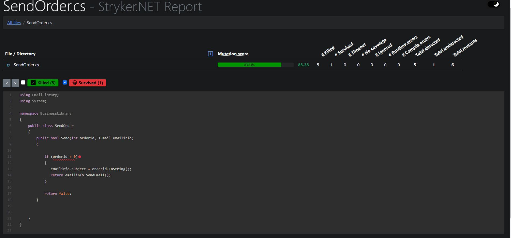

# Mutation-testing ?- Testing your tests

Mutation Testing is a type of Software Testing that is performed to design new software tests and also evaluate the quality of already existing software tests.

Mutation testing is a way to measure the effectiveness of unit tests.

Bugs, or _mutants_, are automatically inserted into your production code. Your tests are run for each mutant. If your tests _fail_ then the mutant is _killed_. If your tests passed, the mutant _survived_. The higher the percentage of mutants killed, the more _effective_ your tests are.

## How does mutation testing work ?

It validates and check the quality of your tests by introducing changes into your code and seeing if your test suite detects them.

## Mutation testing .NET

You can do Mutation Testing in .NET via Stryker.NET library

# Install Stryker
    dotnet tool install -g dotnet-stryker
# How to Run of Mutation Tests

To execute mutation tests we need:

1.  Open Console or PowerShell.
2.  Open folder with our Unit Tests.
3.  Type  `dotnet stryker`  command.

## Sample Mutation report

